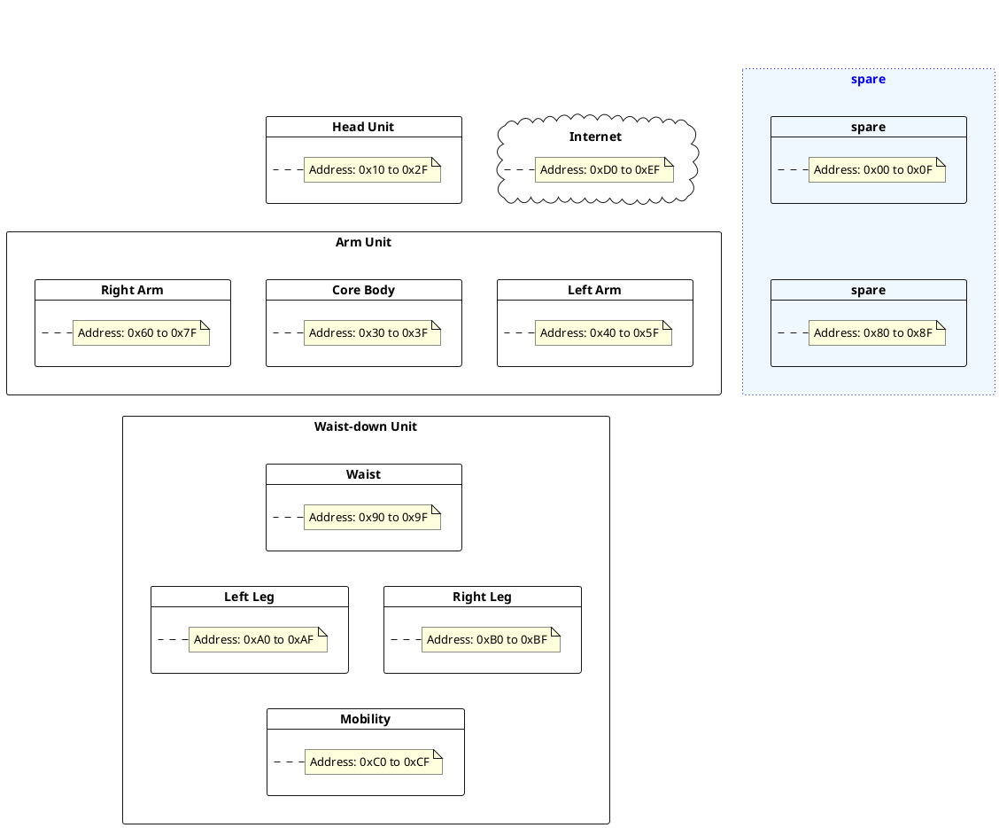

### General

details

#### 機器のアドレスマップ

| Address | Unit | module    | Name            | Device   | Description            |
| :------ | :--- | :-------- | :-------------- | :------- | :--------------------- |
| 0x11    | Head | Planetary | Head Planetary  | Jetson   | システム全体を統括する |
| 0x21    | Head | Satellite | Neck Controller | M5AtomS3 | 首の制御を担当する     |

